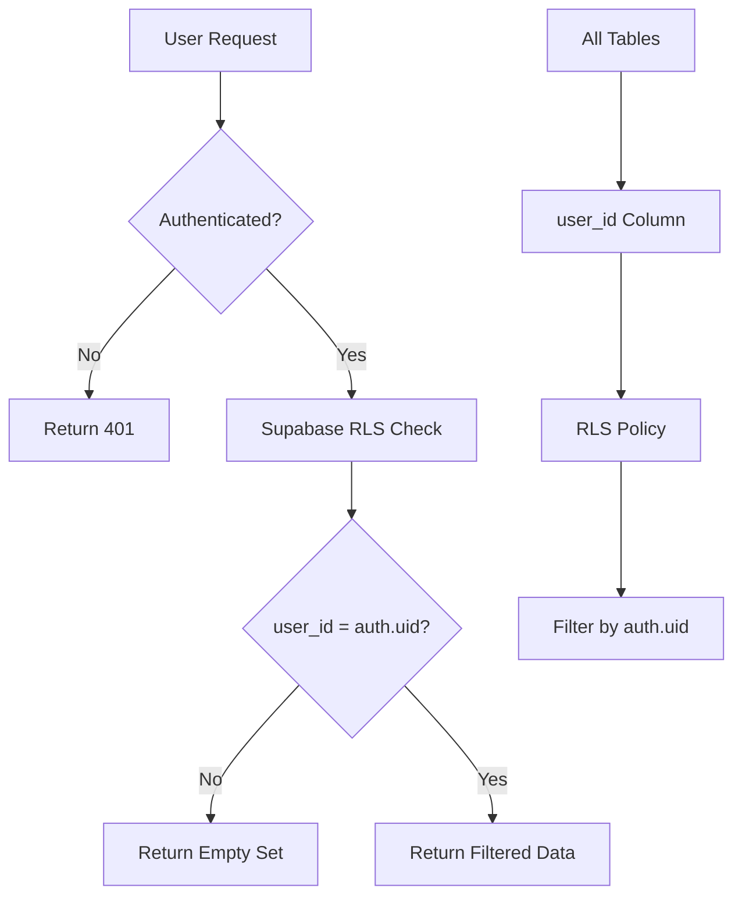

# Multi-Tenancy Design Document
**Version:** 1.0.0  
**Status:** Finalized  
**Decision Date:** 2026-01-05

---

## Executive Summary

VibeCRM implements **RLS-based (Row-Level Security) multi-tenancy** using Supabase PostgreSQL. This approach provides strong data isolation while maintaining simplicity and performance within Supabase's free tier constraints.

**Key Decision:** Shared schema with RLS policies (not schema-per-tenant)

---

## Architecture Overview

### Data Isolation Strategy



### Tenant Identification

- **Tenant = User:** Each authenticated user is a tenant
- **Project Limit:** One project per user (MVP constraint)
- **Data Filtering:** Every row in every table has `user_id UUID REFERENCES auth.users(id)`

---

## Implementation Details

### 1. Database Schema Pattern

**Every user-generated table must follow this pattern:**

```sql
CREATE TABLE {table_name} (
  id UUID PRIMARY KEY DEFAULT gen_random_uuid(),
  user_id UUID REFERENCES auth.users(id) NOT NULL,  -- TENANT IDENTIFIER
  -- ... business columns ...
  created_at TIMESTAMPTZ DEFAULT NOW() NOT NULL,
  updated_at TIMESTAMPTZ DEFAULT NOW() NOT NULL
);

-- CRITICAL: Enable RLS
ALTER TABLE {table_name} ENABLE ROW LEVEL SECURITY;

-- CRITICAL: Create isolation policy
CREATE POLICY user_isolation ON {table_name}
  FOR ALL TO authenticated
  USING (user_id = auth.uid())
  WITH CHECK (user_id = auth.uid());

-- INDEX for performance (user_id is in every query)
CREATE INDEX idx_{table_name}_user_id ON {table_name}(user_id);
```

### 2. RLS Policy Template

**Policy Purpose:** Ensure users can ONLY access their own data

```sql
-- Read, Insert, Update, Delete all filtered by user_id
CREATE POLICY user_isolation ON {table_name}
  FOR ALL                          -- Applies to SELECT, INSERT, UPDATE, DELETE
  TO authenticated                 -- Only logged-in users
  USING (user_id = auth.uid())    -- Read filter: WHERE user_id = auth.uid()
  WITH CHECK (user_id = auth.uid()); -- Write check: Inserts must set user_id = auth.uid()
```

**Example for `deals` table:**

```sql
CREATE POLICY user_isolation ON deals
  FOR ALL TO authenticated
  USING (user_id = auth.uid())
  WITH CHECK (user_id = auth.uid());
```

### 3. Application-Level Enforcement

**NEVER filter by `user_id` in application code.** Let RLS handle it.

```tsx
// ❌ WRONG - Application-level filtering
const { data } = await supabase
  .from("deals")
  .select("*")
  .eq("user_id", currentUser.id);  // RLS already does this!

// ✅ CORRECT - Let RLS handle filtering
const { data } = await supabase
  .from("deals")
  .select("*");  // RLS automatically filters to current user's data
```

**Why?** RLS is enforced at the database level, cannot be bypassed, and reduces code complexity.

---

## Security Guarantees

### 1. Impossible to Bypass RLS

Even with direct database access, RLS policies enforce isolation:

```sql
-- User 1 (ID: abc-123) executes:
SELECT * FROM deals;

-- Postgres automatically rewrites to:
SELECT * FROM deals WHERE user_id = 'abc-123';
```

### 2. No Application-Level Logic

All permissions are **declarative** (SQL policies), not imperative (if statements in code).

**Benefits:**
- ✅ Single source of truth (database schema)
- ✅ Impossible to forget permission checks
- ✅ Audit-friendly (policies visible in schema)

### 3. Service Role Key Protection

**Service role key** bypasses RLS → NEVER expose to frontend.

```typescript
// ❌ WRONG - Service key in frontend
const supabase = createClient(URL, SERVICE_ROLE_KEY);

// ✅ CORRECT - Service key ONLY in server-side API routes
// Frontend uses anon key:
const supabase = createClient(URL, ANON_KEY);
```

---

## Performance Considerations

### 1. Index Strategy

Every `user_id` column must have an index:

```sql
CREATE INDEX idx_{table_name}_user_id ON {table_name}(user_id);
```

**Why?** Every query has `WHERE user_id = auth.uid()` → without index, full table scans.

### 2. Connection Pooling

Supabase free tier: ~60 concurrent connections

**Mitigation:**
```typescript
// Use transaction mode in PgBouncer
const supabase = createClient(URL, KEY, {
  db: { schema: 'public' },
  auth: { persistSession: false },  // Don't hold connections
});
```

### 3. Query Performance

**Good:** RLS adds minimal overhead (~1-2ms per query)  
**Bad:** Complex RLS policies with subqueries can slow queries

**Our Policy (Simple):**
```sql
-- Fast: Single equality check
USING (user_id = auth.uid())
```

**Avoid:**
```sql
-- Slow: Subquery in policy
USING (user_id IN (SELECT id FROM team_members WHERE team_id = auth.uid()))
```

---

## Scaling Path

### MVP (Current): One Project Per User

**Constraint:**
```sql
CREATE UNIQUE INDEX one_project_per_user ON projects(user_id);
```

**Justification:**
- Simplifies onboarding UX
- Reduces quota concerns on free tier
- Forces users to consolidate entities in one CRM

### Future: Multi-Project Support

**When:** Post-MVP, for Pro/Enterprise tiers

**Changes Required:**
1. Remove `one_project_per_user` constraint
2. Add project switcher UI
3. Update RLS policies to filter by `project_id` instead of `user_id`
4. Implement quota enforcement per tier

**New RLS Pattern:**
```sql
-- Filter by project membership (not direct user ownership)
CREATE POLICY project_members_only ON deals
  FOR ALL TO authenticated
  USING (
    project_id IN (
      SELECT project_id FROM project_members WHERE user_id = auth.uid()
    )
  );
```

---

## Alternative Considered: Schema-Per-Tenant

### Why We Didn't Choose This

**Schema-Per-Tenant:**
```sql
CREATE SCHEMA tenant_abc123;
CREATE TABLE tenant_abc123.deals (...);

CREATE SCHEMA tenant_xyz789;
CREATE TABLE tenant_xyz789.deals (...);
```

**Pros:**
- ✅ Perfect isolation (cannot mix data even with bugs)
- ✅ Easy to export/delete entire tenant

**Cons:**
- ❌ Supabase free tier: Limited connection pooling (each schema needs connections)
- ❌ Complex migrations (must apply to ALL schemas)
- ❌ No cross-tenant analytics (dashboards, admin reports)
- ❌ Harder to debug (which schema has the issue?)

**Decision:** RLS is better fit for VibeCRM's use case and Supabase constraints.

---

## RLS Testing Strategy

### 1. Unit Tests

```typescript
// tests/rls-policies.test.ts
describe("RLS Policies", () => {
  it("should prevent user A from seeing user B's data", async () => {
    // Create two users
    const userA = await createTestUser("userA@example.com");
    const userB = await createTestUser("userB@example.com");
    
    // User A creates a deal
    const supabaseA = createClient(URL, ANON_KEY, { auth: { user: userA } });
    await supabaseA.from("deals").insert({ name: "Deal A", user_id: userA.id });
    
    // User B queries deals
    const supabaseB = createClient(URL, ANON_KEY, { auth: { user: userB } });
    const { data } = await supabaseB.from("deals").select("*");
    
    // Expect: User B sees ZERO deals (not Deal A)
    expect(data).toHaveLength(0);
  });
});
```

### 2. Integration Tests

```typescript
it("should enforce RLS on all CRUD operations", async () => {
  const userA = await createTestUser("userA@example.com");
  const userB = await createTestUser("userB@example.com");
  
  const supabaseA = clientForUser(userA);
  const supabaseB = clientForUser(userB);
  
  // User A creates
  const { data: dealA } = await supabaseA.from("deals").insert({ name: "A" }).select().single();
  
  // User B tries to UPDATE User A's deal (should fail)
  const { error } = await supabaseB.from("deals").update({ name: "Hacked" }).eq("id", dealA.id);
  expect(error).toBeTruthy();  // RLS blocks update
  
  // User B tries to DELETE User A's deal (should fail)
  const { error: deleteError } = await supabaseB.from("deals").delete().eq("id", dealA.id);
  expect(deleteError).toBeTruthy();  // RLS blocks delete
});
```

### 3. Adversarial Tests

```typescript
it("should prevent SQL injection bypassing RLS", async () => {
  const userA = await createTestUser("userA@example.com");
  const supabaseA = clientForUser(userA);
  
  // Attempt to inject malicious SQL
  const { data } = await supabaseA
    .from("deals")
    .select("*")
    .eq("name", "'; DROP TABLE deals; --");
  
  // Expect: Parameterized queries prevent injection
  expect(data).toBeDefined();  // Query executes safely, returns empty
});
```

---

## Monitoring & Alerts

### Metrics to Track

1. **RLS Policy Evaluation Time:**
   - Track query latency for tables with RLS
   - Alert if p95 > 100ms (policy too complex)

2. **RLS Policy Violations:**
   - Log attempted unauthorized access (captured in Supabase logs)
   - Pattern: `SELECT` with 0 results but expected data

3. **Missing RLS Policies:**
   - Run nightly check: All user tables have RLS enabled
   - Alert if any table has `relrowsecurity = false`

### Audit Query

```sql
-- Find tables without RLS enabled
SELECT schemaname, tablename 
FROM pg_tables
WHERE schemaname = 'public'
  AND tablename NOT IN ('projects', 'vibe_configs', 'decision_traces')  -- Core tables
  AND tablename NOT IN (
    SELECT tablename FROM pg_policies WHERE schemaname = 'public'
  );
```

---

## Migration Path from RLS to Schema-Per-Tenant (Future)

If VibeCRM scales beyond 10,000 users, consider migrating to schema-per-tenant.

**Migration Strategy:**

1. **Phase 1:** Create new schema for each tenant
   ```sql
   CREATE SCHEMA tenant_{user_id};
   ```

2. **Phase 2:** Copy data from public schema to tenant schema
   ```sql
   INSERT INTO tenant_{user_id}.deals 
   SELECT * FROM public.deals WHERE user_id = {user_id};
   ```

3. **Phase 3:** Update application to route queries to correct schema
   ```typescript
   const schema = `tenant_${user.id}`;
   const supabase = createClient(URL, KEY, { db: { schema } });
   ```

4. **Phase 4:** Remove RLS policies from public schema (no longer needed)

**Timeline:** Post-Series A funding, >10K users, or enterprise customer requirement.

---

## Conclusion

**Chosen Architecture:** RLS-based multi-tenancy

**Why:**
- ✅ Simpler to implement and maintain
- ✅ Better performance for <10K users
- ✅ Fits Supabase free tier constraints
- ✅ Strong security guarantees (database-level enforcement)

**Trade-Offs Accepted:**
- ⚠️ Shared schema means potential for RLS bugs (mitigated by testing)
- ⚠️ Harder to migrate individual tenants (future concern)

**Next Steps:**
- ✅ Implement RLS policies for all core tables
- ✅ Write RLS unit tests
- 🔄 Monitor query performance post-launch
- 🔮 Re-evaluate schema-per-tenant at 10K users
