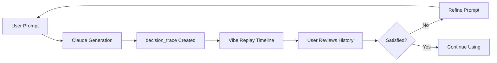

# Vibe Replay Specification
**AI Transparency & Decision History UI**  
**Version:** 1.0.0  
**Status:** Architectural Recommendation (Approved)

---

## Overview

**Vibe Replay** is VibeCRM's AI transparency feature that shows users a chronological timeline of all AI prompts, schema changes, and decision reasoning. It transforms the backend `decision_traces` table into a user-facing UX differentiator.

**Goal:** Users should understand *how* and *why* their CRM evolved, building trust in the AI system.

---

## Core Concept



**Key Insight:** Most AI tools feel like "black boxes." Vibe Replay shows the entire decision-making process, making AI feel collaborative (not mysterious).

---

## Data Model

### decision_traces Schema

```sql
CREATE TABLE decision_traces (
  id UUID PRIMARY KEY DEFAULT gen_random_uuid(),
  project_id UUID REFERENCES projects(id) ON DELETE CASCADE,
  user_id UUID REFERENCES auth.users(id) NOT NULL,
  intent TEXT NOT NULL,              -- User's original prompt
  action TEXT NOT NULL,               -- What was generated/modified
  precedent TEXT,                     -- AI's reasoning
  version TEXT NOT NULL,              -- Schema version (semver)
  timestamp TIMESTAMPTZ DEFAULT NOW() NOT NULL,
  
  -- Optional: Store schema diff for visualization
  schema_before JSONB,
  schema_after JSONB
);

CREATE INDEX idx_decision_traces_project_timestamp 
ON decision_traces(project_id, timestamp DESC);
```

### Example Entry

```json
{
  "id": "abc-123",
  "project_id": "proj-456",
  "user_id": "user-789",
  "intent": "I need to track sales deals with companies and contacts",
  "action": "Generated 3 tables: deals, companies, contacts. Created foreign keys: deals.company_id → companies.id, deals.contact_id → contacts.id",
  "precedent": "Standard CRM pattern. Deals represent sales opportunities. Many deals can be associated with one company (many-to-one relationship). Used TEXT for flexible names, NUMERIC for deal values, TIMESTAMPTZ for close dates.",
  "version": "1.0.0",
  "timestamp": "2026-01-05T12:30:00Z",
  "schema_before": null,
  "schema_after": { /* full schema JSON */ }
}
```

---

## UI Components

### 1. Timeline View (Primary Interface)

**Layout:**
```
┌─────────────────────────────────────────────────────────┐
│  Vibe Replay                                    [Close] │
├─────────────────────────────────────────────────────────┤
│                                                         │
│  ┌─ 2 days ago ────────────────────────────────────┐   │
│  │  "Add priority field to tasks"                  │   │
│  │                                                  │   │
│  │  ✓ Added column 'priority' to tasks table      │   │
│  │  📝 AI Reasoning: Priority helps organize...   │   │
│  │  [View Schema Diff]                            │   │
│  └─────────────────────────────────────────────────┘   │
│                                                         │
│  ┌─ 5 days ago ────────────────────────────────────┐   │
│  │  "Track sales deals with companies"             │   │
│  │                                                  │   │
│  │  ✓ Created 3 tables: deals, companies, contacts│   │
│  │  ✓ Created 2 foreign keys                      │   │
│  │  📝 AI Reasoning: Standard CRM pattern...      │   │
│  │  [View Schema Diff] [View ER Diagram]          │   │
│  └─────────────────────────────────────────────────┘   │
│                                                         │
│  ┌─ Project Created ────────────────────────────────┐   │
│  │  "Create a new CRM project"                     │   │
│  │  ✓ Initialized empty project                   │   │
│  └─────────────────────────────────────────────────┘   │
└─────────────────────────────────────────────────────────┘
```

**Implementation:**

```tsx
import { Sheet, SheetContent, SheetHeader, SheetTitle } from "@/components/ui/sheet";
import { Card, CardHeader, CardTitle, CardDescription, CardContent } from "@/components/ui/card";
import { Badge } from "@/components/ui/badge";
import { Sparkles, Clock, Code } from "lucide-react";

export function VibeReplayTimeline({ projectId }) {
  const [open, setOpen] = useState(false);
  const { data: traces } = useQuery({
    queryKey: ["decision-traces", projectId],
    queryFn: () => fetch(`/api/v1/vibe-replay/${projectId}`).then(r => r.json()),
  });
  
  return (
    <>
      <Button 
        variant="outline" 
        onClick={() => setOpen(true)}
        className="gap-2"
      >
        <Sparkles className="h-4 w-4" />
        Vibe Replay
      </Button>
      
      <Sheet open={open} onOpenChange={setOpen}>
        <SheetContent side="right" className="w-full sm:max-w-2xl overflow-y-auto">
          <SheetHeader>
            <SheetTitle className="flex items-center gap-2">
              <Sparkles className="h-5 w-5" />
              Vibe Replay
            </SheetTitle>
            <p className="text-sm text-muted-foreground">
              Your CRM's evolution, powered by AI
            </p>
          </SheetHeader>
          
          <div className="mt-8 space-y-6">
            {traces?.map((trace, index) => (
              <TraceCard 
                key={trace.id} 
                trace={trace} 
                isFirst={index === 0}
              />
            ))}
          </div>
        </SheetContent>
      </Sheet>
    </>
  );
}

function TraceCard({ trace, isFirst }) {
  const [showDiff, setShowDiff] = useState(false);
  
  return (
    <Card className={cn(
      "relative",
      isFirst && "border-primary shadow-md"
    )}>
      {isFirst && (
        <Badge className="absolute -top-2 right-4 bg-primary">Latest</Badge>
      )}
      
      <CardHeader>
        <div className="flex items-start gap-3">
          <div className="mt-1">
            <Clock className="h-4 w-4 text-muted-foreground" />
          </div>
          <div className="flex-1">
            <CardDescription className="text-xs mb-2">
              {formatDistanceToNow(new Date(trace.timestamp), { addSuffix: true })}
            </CardDescription>
            <CardTitle className="text-base font-medium mb-2">
              "{trace.intent}"
            </CardTitle>
          </div>
        </div>
      </CardHeader>
      
      <CardContent>
        <div className="space-y-3">
          {/* Action taken */}
          <div className="flex gap-2">
            <Badge variant="secondary" className="font-normal">
              ✓ {trace.action}
            </Badge>
          </div>
          
          {/* AI Reasoning (collapsible) */}
          {trace.precedent && (
            <Collapsible>
              <CollapsibleTrigger className="flex items-center gap-2 text-sm text-muted-foreground hover:text-foreground">
                <Code className="h-4 w-4" />
                AI Reasoning
              </CollapsibleTrigger>
              <CollapsibleContent className="mt-2 text-sm bg-muted p-3 rounded-md">
                {trace.precedent}
              </CollapsibleContent>
            </Collapsible>
          )}
          
          {/* Schema diff viewer */}
          {trace.schema_before && trace.schema_after && (
            <Button
              variant="outline"
              size="sm"
              onClick={() => setShowDiff(!showDiff)}
            >
              {showDiff ? "Hide" : "View"} Schema Diff
            </Button>
          )}
          
          {showDiff && (
            <SchemaDiffViewer 
              before={trace.schema_before}
              after={trace.schema_after}
            />
          )}
        </div>
      </CardContent>
    </Card>
  );
}
```

---

### 2. Schema Diff Viewer

**Visual Diff (Before/After):**

```tsx
import { diffLines } from "diff";
import { Prism as SyntaxHighlighter } from "react-syntax-highlighter";

function SchemaDiffViewer({ before, after }) {
  const beforeSQL = generateSQLFromSchema(before);
  const afterSQL = generateSQLFromSchema(after);
  
  const diff = diffLines(beforeSQL, afterSQL);
  
  return (
    <div className="border rounded-md overflow-hidden">
      <div className="grid grid-cols-2 divide-x">
        {/* Before */}
        <div className="p-4 bg-muted/50">
          <h4 className="text-xs font-semibold mb-2 text-muted-foreground">Before</h4>
          <SyntaxHighlighter language="sql" className="text-xs">
            {beforeSQL}
          </SyntaxHighlighter>
        </div>
        
        {/* After */}
        <div className="p-4">
          <h4 className="text-xs font-semibold mb-2 text-primary">After</h4>
          <SyntaxHighlighter language="sql" className="text-xs">
            {afterSQL}
          </SyntaxHighlighter>
        </div>
      </div>
      
      {/* Highlighted changes */}
      <div className="border-t p-4 bg-background">
        <h4 className="text-xs font-semibold mb-2">Changes</h4>
        <div className="space-y-1 font-mono text-xs">
          {diff.map((part, index) => (
            <div
              key={index}
              className={cn(
                part.added && "bg-green-500/10 text-green-700 dark:text-green-400",
                part.removed && "bg-red-500/10 text-red-700 dark:text-red-400 line-through"
              )}
            >
              {part.value}
            </div>
          ))}
        </div>
      </div>
    </div>
  );
}
```

---

### 3. ER Diagram Visualization (Mermaid)

```tsx
import mermaid from "mermaid";
import { useEffect, useRef } from "react";

function ERDiagramViewer({ schema }) {
  const ref = useRef<HTMLDivElement>(null);
  
  useEffect(() => {
    if (ref.current) {
      const mermaidCode = generateMermaidERD(schema);
      mermaid.render("er-diagram", mermaidCode).then(({ svg }) => {
        ref.current!.innerHTML = svg;
      });
    }
  }, [schema]);
  
  return (
    <div className="border rounded-md p-4 bg-muted/30 overflow-x-auto">
      <div ref={ref} />
    </div>
  );
}

function generateMermaidERD(schema: CRMSchema): string {
  let code = "erDiagram\n";
  
  schema.tables.forEach((table) => {
    const columns = table.columns
      .filter(col => !["id", "user_id", "created_at", "updated_at"].includes(col.name))
      .map(col => `${col.type} ${col.name}`)
      .join("\n    ");
      
    code += `  ${table.name} {\n    ${columns}\n  }\n`;
  });
  
  // Add relationships
  schema.tables.forEach((table) => {
    table.columns.forEach((col) => {
      if (col.references) {
        const cardinality = col.nullable ? "|o" : "||";
        code += `  ${table.name} ${cardinality}--|| ${col.references.table} : has\n`;
      }
    });
  });
  
  return code;
}
```

---

## Innovative Features (Future Enhancements)

### 1. "Undo" Capability (Post-MVP)

**Concept:** User can revert to a previous schema version

```tsx
function TraceCard({ trace }) {
  const [undoing, setUndoing] = useState(false);
  
  async function handleUndo() {
    setUndoing(true);
    
    await fetch(`/api/v1/provision`, {
      method: "POST",
      body: JSON.stringify({
        schema_json: trace.schema_before,
        project_id: trace.project_id,
      }),
    });
    
    toast.success("Reverted to previous schema");
    setUndoing(false);
  }
  
  return (
    <Card>
      {/* ... trace content ... */}
      
      {trace.schema_before && (
        <Button
          variant="destructive"
          size="sm"
          onClick={handleUndo}
          disabled={undoing}
        >
          {undoing ? "Reverting..." : "Undo This Change"}
        </Button>
      )}
    </Card>
  );
}
```

**Challenges:**
- Data migration: What if user added 100 records to a table that gets dropped?
- Foreign key constraints: Reverting may break existing data
- **Solution:** Show data impact preview before undo, require confirmation

### 2. AI Suggestions Based on Usage Patterns

**Concept:** After 10+ uses, Vibe Replay suggests optimizations

```tsx
function SmartSuggestion({ projectId }) {
  const { data: suggestion } = useQuery({
    queryKey: ["ai-suggestions", projectId],
    queryFn: async () => {
      // Analyze decision_traces for patterns
      const traces = await fetchTraces(projectId);
      
      // Example: Detect redundant columns
      if (traces.some(t => t.intent.includes("phone") && t.intent.includes("mobile"))) {
        return {
          type: "optimization",
          message: "I noticed you're tracking both 'phone' and 'mobile' fields. Combine them into a single 'contact_numbers' field?",
          action: "combine_fields",
        };
      }
      
      return null;
    },
  });
  
  if (!suggestion) return null;
  
  return (
    <Alert className="mt-6 border-primary">
      <Lightbulb className="h-4 w-4" />
      <AlertTitle>AI Suggestion</AlertTitle>
      <AlertDescription>
        {suggestion.message}
        <Button variant="link" className="p-0 h-auto ml-2">
          Apply Suggestion
        </Button>
      </AlertDescription>
    </Alert>
  );
}
```

### 3. Export as Documentation

**Concept:** Generate a markdown report of all schema changes

```tsx
async function exportVibeReplay(projectId: string) {
  const traces = await fetchTraces(projectId);
  
  let markdown = "# VibeCRM Schema Evolution Report\n\n";
  markdown += `Generated: ${new Date().toISOString()}\n\n`;
  
  traces.forEach((trace, index) => {
    markdown += `## Change ${index + 1}: ${trace.version}\n`;
    markdown += `**Date:** ${formatDate(trace.timestamp)}\n\n`;
    markdown += `**User Intent:**\n> ${trace.intent}\n\n`;
    markdown += `**Action Taken:**\n${trace.action}\n\n`;
    markdown += `**AI Reasoning:**\n${trace.precedent}\n\n`;
    markdown += `---\n\n`;
  });
  
  // Download as .md file
  const blob = new Blob([markdown], { type: "text/markdown" });
  const url = URL.createObjectURL(blob);
  const a = document.createElement("a");
  a.href = url;
  a.download = `vibe-replay-${projectId}.md`;
  a.click();
}

<Button onClick={() => exportVibeReplay(projectId)} variant="outline">
  Export Report
</Button>
```

---

## Keyboard Shortcuts

- **`Cmd/Ctrl + /`:** Open Vibe Replay
- **`Escape`:** Close Vibe Replay
- **Arrow Up/Down:** Navigate between traces
- **`D`:** Toggle diff view for selected trace

```tsx
useEffect(() => {
  const handleKeyDown = (e: KeyboardEvent) => {
    if ((e.metaKey || e.ctrlKey) && e.key === "/") {
      e.preventDefault();
      setOpenVibeReplay(true);
    }
  };
  
  document.addEventListener("keydown", handleKeyDown);
  return () => document.removeEventListener("keydown", handleKeyDown);
}, []);
```

---

## API Endpoint

### `GET /api/v1/vibe-replay/:project_id`

**Response:**

```typescript
interface VibeReplayResponse {
  traces: DecisionTrace[];
  schema_versions: {
    version: string;
    created_at: string;
    is_active: boolean;
  }[];
  current_schema: CRMSchema;
}

interface DecisionTrace {
  id: string;
  intent: string;
  action: string;
  precedent: string;
  version: string;
  timestamp: string;
  schema_before: CRMSchema | null;
  schema_after: CRMSchema;
}
```

**Implementation:**

```typescript
// app/api/v1/vibe-replay/[projectId]/route.ts
export async function GET(
  request: Request,
  { params }: { params: { projectId: string } }
) {
  const user = await getUser(request);
  
  // Fetch traces (RLS filters to user's data)
  const { data: traces } = await supabase
    .from("decision_traces")
    .select("*")
    .eq("project_id", params.projectId)
    .order("timestamp", { ascending: false });
  
  // Fetch schema versions
  const { data: versions } = await supabase
    .from("vibe_configs")
    .select("schema_version, created_at, is_active")
    .eq("project_id", params.projectId)
    .order("created_at", { ascending: false });
  
  // Fetch current active schema
  const { data: currentConfig } = await supabase
    .from("vibe_configs")
    .select("schema_json")
    .eq("project_id", params.projectId)
    .eq("is_active", true)
    .single();
  
  return Response.json({
    traces,
    schema_versions: versions,
    current_schema: currentConfig?.schema_json,
  });
}
```

---

## User Benefits

### Trust & Transparency
- Users see *exactly* what the AI did
- No "magic" or unexplained changes
- Builds confidence in AI decisions

### Learning Tool
- Users learn SQL/database concepts by reading AI reasoning
- Example: "Why did you choose many-to-one here?"

### Debugging Aid
- When something breaks, check timeline to see what changed
- Example: "My filters stopped working after yesterday's change"

### Collaboration
- Share Vibe Replay export with team
- Document schema evolution for compliance/audit

---

## Testing Strategy

### Unit Tests
```typescript
describe("Vibe Replay Timeline", () => {
  it("should display traces in reverse chronological order", () => {
    const traces = [
      { timestamp: "2026-01-03", intent: "Add priority" },
      { timestamp: "2026-01-01", intent: "Create CRM" },
    ];
    
    render(<VibeReplayTimeline traces={traces} />);
    
    const cards = screen.getAllByRole("article");
    expect(cards[0]).toHaveTextContent("Add priority");
    expect(cards[1]).toHaveTextContent("Create CRM");
  });
});
```

### Integration Tests
- Verify `GET /api/v1/vibe-replay/:projectId` returns correct data
- Test RLS filtering (User A can't see User B's traces)

### E2E Tests (Playwright)
```typescript
test("Vibe Replay end-to-end", async ({ page }) => {
  await page.goto("/dashboard");
  
  // Click Vibe Replay button
  await page.click("text=Vibe Replay");
  
  // Verify timeline is visible
  await expect(page.locator("text=Your CRM's evolution")).toBeVisible();
  
  // Expand a trace
  await page.click("text=AI Reasoning");
  await expect(page.locator("text=Standard CRM pattern")).toBeVisible();
  
  // View schema diff
  await page.click("text=View Schema Diff");
  await expect(page.locator("text=Before")).toBeVisible();
  await expect(page.locator("text=After")).toBeVisible();
});
```

---

## Implementation Checklist

- [ ] Create `GET /api/v1/vibe-replay/:projectId` endpoint
- [ ] Build `VibeReplayTimeline` component
- [ ] Build `TraceCard` component with collapsible reasoning
- [ ] Implement `SchemaDiffViewer` with syntax highlighting
- [ ] Implement `ERDiagramViewer` with Mermaid
- [ ] Add keyboard shortcut (`Cmd/` to open)
- [ ] Add export to markdown feature
- [ ] Write unit tests for timeline rendering
- [ ] Write E2E tests for full user flow
- [ ] Add to main navigation (header or sidebar)
- [ ] (Future) Implement undo capability
- [ ] (Future) Implement AI suggestions based on usage

---

## Conclusion

Vibe Replay is VibeCRM's secret weapon for building user trust. By making AI decisions transparent and reviewable, it transforms what could feel like a "black box" into a collaborative partner.

**Next Steps:**
1. ✅ Specification approved
2. 🔄 Implement basic timeline (MVP)
3. 🔮 Add undo and AI suggestions (post-MVP)
