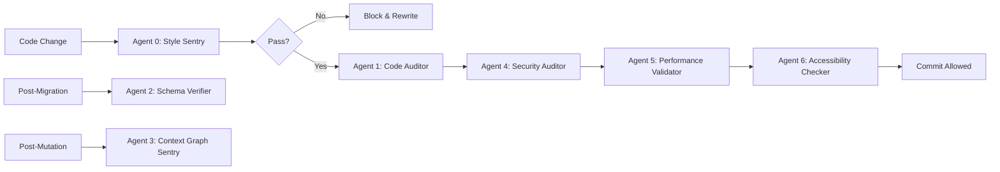

# Subagent Execution Protocol (v2.0)
> **RUN COMMAND:** `subagent --monitor --validate`

## Overview
Subagents are automated quality gates that run before, during, and after code changes to ensure VibeCRM maintains architectural integrity, security, performance, and accessibility standards.

---

## Agent 0: The Style Sentry
**Purpose:** Enforce coding standards and architectural consistency  
**When:** Pre-commit, IDE on-save  
**Exit Condition:** BLOCKING (code must pass before proceeding)

### Checks
- ✅ Verify current task against `instructions.md` rules
- ✅ Ensure **no Ant Design components** are imported (force shadcn/ui only)
- ✅ Check for **"Reasoning" headers** in all new files (JSDoc `@fileoverview`)
- ✅ Validate **naming conventions** (snake_case tables, PascalCase TypeScript)
- ✅ Ensure all new tables include `user_id`, `created_at`, `updated_at`

### Implementation
```bash
#!/bin/bash
# .husky/pre-commit hook

# Check for banned imports
if grep -r "@ant-design\|antd" src/; then
  echo "❌ STYLE SENTRY FAIL: Ant Design detected. Use shadcn/ui only."
  exit 1
fi

# Check for file headers
missing_headers=$(find src/ -name "*.tsx" -o -name "*.ts" | xargs grep -L "@fileoverview")
if [ -n "$missing_headers" ]; then
  echo "❌ STYLE SENTRY FAIL: Missing @fileoverview in:"
  echo "$missing_headers"
  exit 1
fi

echo "✅ Style Sentry: PASS"
```

**Exit Status:** If Agent 0 fails, the AI must rewrite code to match styling rules immediately.

---

## Agent 1: The Code Auditor (Static Analysis)
**Purpose:** Catch TypeScript errors and linting violations  
**When:** Pre-commit, CI/CD pipeline  
**Exit Condition:** BLOCKING

### Checks
- ✅ TypeScript strict mode compliance (no `any`, proper types)
- ✅ ESLint rules (unused imports, console.logs in production)
- ✅ Prettier formatting
- ✅ Import order and unused dependencies

### Implementation
```bash
npm run type-check && npm run lint
```

**Expected Output:**
```
✅ Type Check: 0 errors
✅ ESLint: 0 warnings, 0 errors
```

**Fix Command:**
```bash
npm run lint:fix && npm run format
```

---

## Agent 2: The Schema Verifier
**Purpose:** Ensure database schema matches API contracts and code expectations  
**When:** Post-migration, CI/CD  
**Exit Condition:** WARNING (non-blocking but requires review)

### Checks
- ✅ Match `api-contracts.json` entities against Supabase schema
- ✅ Verify all tables have RLS policies enabled
- ✅ Check for orphaned foreign keys (references to non-existent tables)
- ✅ Validate index existence on all foreign keys and `user_id` columns
- ✅ Ensure `created_at`/`updated_at` triggers are active

### Implementation
```typescript
// scripts/verify-schema.ts
import { createClient } from "@supabase/supabase-js";
import apiContracts from "../api-contracts.json";

async function verifySchema() {
  const supabase = createClient(process.env.SUPABASE_URL!, process.env.SUPABASE_SERVICE_KEY!);
  
  // Get all tables
  const { data: tables } = await supabase
    .from("information_schema.tables")
    .select("table_name")
    .eq("table_schema", "public");
  
  // Check each entity in api-contracts.json
  for (const [entity, schema] of Object.entries(apiContracts.entities)) {
    const tableName = entity.toLowerCase() + "s"; // Convention: plural
    
    if (!tables?.find(t => t.table_name === tableName)) {
      console.warn(`⚠️ Table '${tableName}' defined in contracts but missing in DB`);
    }
    
    // Check RLS enabled
    const { data: rlsCheck } = await supabase.rpc("check_rls_enabled", { table_name: tableName });
    if (!rlsCheck) {
      console.error(`❌ RLS not enabled on '${tableName}'`);
      process.exit(1);
    }
  }
  
  console.log("✅ Schema Verifier: PASS");
}

verifySchema();
```

**Run Command:**
```bash
tsx scripts/verify-schema.ts
```

---

## Agent 3: The Context Graph Sentry
**Purpose:** Ensure AI decision tracing is complete  
**When:** Post-mutation (create/update/delete operations)  
**Exit Condition:** WARNING

### Checks
- ✅ All `useForm` hooks trigger `decision_trace` creation for schema changes
- ✅ All `/api/v1/generate` calls create trace records
- ✅ All `/api/v1/provision` calls update trace with provisioning status
- ✅ Traces include: `intent`, `action`, `precedent`, `version`

### Implementation
```typescript
// middleware/trace-logger.ts
import { NextRequest } from "next/server";

export async function traceLogger(req: NextRequest) {
  if (req.url.includes("/api/v1/generate") || req.url.includes("/api/v1/provision")) {
    const body = await req.json();
    
    // Verify decision_trace is created
    const hasTraceLogic = req.headers.get("x-trace-enabled") === "true";
    
    if (!hasTraceLogic) {
      console.warn("⚠️ Context Graph Sentry: Missing decision_trace logic in", req.url);
    }
  }
}
```

**Validation Pattern (in useForm hooks):**
```tsx
const { mutate } = useForm({
  onSuccess: async (data) => {
    // ✅ REQUIRED: Log decision trace
    await supabase.from("decision_traces").insert({
      project_id: currentProject.id,
      user_id: user.id,
      intent: userPrompt,
      action: `Created ${data.table_count} tables`,
      precedent: data.ai_reasoning,
      version: data.schema_version,
    });
  },
});
```

---

## Agent 4: The Security Auditor (NEW)
**Purpose:** Detect security vulnerabilities before deployment  
**When:** Pre-commit, CI/CD  
**Exit Condition:** BLOCKING for critical issues

### Checks
- ✅ No exposed secrets (API keys, passwords in code)
- ✅ No raw SQL execution (must use parameterized queries)
- ✅ All API routes verify authentication (`getServerSession` or Supabase Auth)
- ✅ CSRF protection enabled on mutation routes
- ✅ Rate limiting implemented on `/api/v1/generate` and `/api/v1/provision`
- ✅ Environment variables validated (`.env.example` matches `.env.local`)

### Implementation
```bash
# Check for exposed secrets
if grep -r "sk-ant-\|supabase.*anon.*key" src/; then
  echo "❌ SECURITY AUDIT FAIL: Exposed API keys detected"
  exit 1
fi

# Check for raw SQL
if grep -r "\.rpc('execute_sql'" src/; then
  echo "❌ SECURITY AUDIT FAIL: Raw SQL execution detected"
  exit 1
fi

# Check authentication on API routes
for file in $(find src/app/api -name "route.ts"); do
  if ! grep -q "getServerSession\|supabase.auth.getUser" "$file"; then
    echo "⚠️ WARNING: $file may be missing auth check"
  fi
done

echo "✅ Security Auditor: PASS"
```

**Tools:**
- `trufflehog` for secret scanning
- `npm audit` for vulnerable dependencies
- Custom script for SQL injection patterns

---

## Agent 5: The Performance Validator (NEW)
**Purpose:** Prevent performance regressions  
**When:** Pre-deployment, CI/CD  
**Exit Condition:** WARNING (blocking for severe issues)

### Checks
- ✅ Detect N+1 query patterns (`useOne` in loops → suggest `useMany`)
- ✅ Check for missing database indexes on foreign keys
- ✅ Validate bundle size < 500KB (gzipped)
- ✅ Lighthouse performance score > 90
- ✅ No blocking third-party scripts
- ✅ All images use Next.js `<Image />` component

### Implementation
```bash
# Bundle size check
npm run build
size=$(du -sh .next/static/chunks/pages | awk '{print $1}')
echo "Bundle size: $size"

# Lighthouse CI
npx lighthouse-ci autorun --collect.numberOfRuns=3 --assert.preset=lighthouse:recommended

# Check for N+1 patterns (static analysis)
if grep -r "\.map(.*useOne" src/; then
  echo "⚠️ PERFORMANCE WARNING: Possible N+1 query detected"
fi

echo "✅ Performance Validator: PASS"
```

**Metrics Dashboard (Future):**
- Core Web Vitals: LCP, FID, CLS
- API route latencies (p50, p95, p99)
- Database query counts per page load

---

## Agent 6: The Accessibility Checker (NEW)
**Purpose:** Ensure WCAG 2.1 AA compliance  
**When:** Pre-deployment, PR reviews  
**Exit Condition:** WARNING (blocking for critical a11y issues)

### Checks
- ✅ All interactive elements have `aria-label` or visible text
- ✅ Color contrast ratio ≥ 4.5:1 (WCAG AA)
- ✅ Keyboard navigation works (Tab, Enter, Escape)
- ✅ Focus indicators visible on `:focus-visible`
- ✅ No missing alt text on images
- ✅ Semantic HTML (`<button>` not `<div onclick>`)

### Implementation
```bash
# Build and run axe-core
npm run build
npx @axe-core/cli dist/ --exit

# Check for missing aria-labels
missing_labels=$(grep -r "<Button" src/ | grep -v "aria-label\|children")
if [ -n "$missing_labels" ]; then
  echo "⚠️ A11Y WARNING: Buttons without labels found"
fi

echo "✅ Accessibility Checker: PASS"
```

**Tools:**
- `@axe-core/cli` for automated a11y testing
- `eslint-plugin-jsx-a11y` for JSX linting
- Manual keyboard navigation testing checklist

---

## Subagent Orchestration

### Execution Order


### CI/CD Integration
```yaml
# .github/workflows/subagents.yml
name: Subagent Validation
on: [push, pull_request]

jobs:
  validate:
    runs-on: ubuntu-latest
    steps:
      - uses: actions/checkout@v3
      - uses: actions/setup-node@v3
        with:
          node-version: 18
      
      - name: Install dependencies
        run: npm ci
      
      - name: Agent 0 - Style Sentry
        run: npm run style-check
      
      - name: Agent 1 - Code Auditor
        run: npm run type-check && npm run lint
      
      - name: Agent 4 - Security Auditor
        run: npm run security-scan
      
      - name: Agent 5 - Performance Validator
        run: npm run perf-check
      
      - name: Agent 6 - Accessibility Checker
        run: npm run a11y-check
```

---

## Hallucination Prevention Strategy

### AI Schema Generation Safeguards
1. **Pre-Generation Validation (Agent 0 equivalent for AI prompts):**
   - Classify intent (CREATE/MODIFY/RELATE only)
   - Estimate entity count (max 15 tables)
   - Check user quota (free tier: 10 AI requests/day)

2. **Post-Generation Validation (Agent 2 equivalent for AI output):**
   - Zod schema validation
   - Reserved keyword detection
   - Circular dependency detection
   - Foreign key integrity check

3. **Semantic Coherence Check (NEW):**
   - Compare user prompt to generated entities using embeddings
   - Flag if similarity score < 0.7
   - Ask user: "Your prompt mentioned X, but schema includes Y. Is this correct?"

4. **Human-in-the-Loop:**
   - Show ER diagram before provisioning
   - Require confirmation checkboxes
   - Display impact estimate (tables, columns, estimated storage)

### Example Hallucination Detection
```typescript
// scripts/detect-hallucination.ts
async function detectHallucination(prompt: string, generatedSchema: CRMSchema) {
  const promptEntities = extractEntities(prompt);  // ["deals", "companies", "contacts"]
  const schemaEntities = generatedSchema.tables.map(t => t.name);
  
  const extraEntities = schemaEntities.filter(e => !promptEntities.includes(e));
  
  if (extraEntities.length > 3) {
    return {
      hallucinated: true,
      warning: `Your prompt mentioned ${promptEntities.length} entities, but schema includes ${schemaEntities.length}. Extra entities: ${extraEntities.join(", ")}`,
      suggestion: "Review the schema or refine your prompt.",
    };
  }
  
  return { hallucinated: false };
}
```

---

## Agent Summary

| Agent | Purpose | When | Exit Condition | Blocks Commit |
|-------|---------|------|----------------|---------------|
| **0** | Style enforcement | Pre-commit | FAIL | ✅ Yes |
| **1** | Type/Lint check | Pre-commit | FAIL | ✅ Yes |
| **2** | Schema verification | Post-migration | WARN | ❌ No |
| **3** | Context graph completeness | Post-mutation | WARN | ❌ No |
| **4** | Security audit | Pre-commit | FAIL (critical) | ✅ Yes |
| **5** | Performance validation | Pre-deploy | WARN | ⚠️ Severe only |
| **6** | Accessibility check | Pre-deploy | WARN | ⚠️ Critical only |

---

## Future Enhancements

### Agent 7: The Data Quality Monitor (Planned)
- Detect data anomalies (NULL inflation, cardinality violations)
- Alert on suspicious patterns (sudden spike in deletions)
- Validate data migrations before/after schema changes

### Agent 8: The Cost Optimizer (Planned)
- Monitor Supabase usage (storage, bandwidth, function invocations)
- Alert when approaching free tier limits
- Suggest optimizations (archive old data, compress images)

---

## Developer Workflow

**Before Writing Code:**
1. Read `instructions.md` for current standards
2. Check `SCHEMA_VALIDATION_SPEC.md` if working on AI features
3. Review `THEME_TOKENS.md` for styling

**During Development:**
- Agent 0 runs on file save (IDE integration)
- Agent 1 runs in watch mode (`npm run dev`)

**Before Committing:**
- All agents 0-6 run via pre-commit hook
- Fix any BLOCKING failures
- Review WARNING messages

**After Deployment:**
- Monitor Agent 5 metrics (performance)
- Review Agent 2 reports (schema drift)
- Check Agent 3 logs (decision trace completeness)

---

**EXIT STATUS:** If any BLOCKING agent fails, code MUST be fixed before proceeding. WARNING agents require review but don't block deployment.